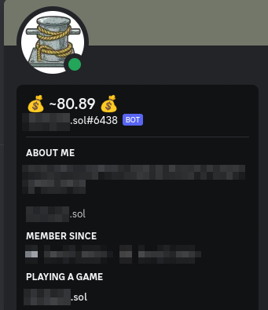
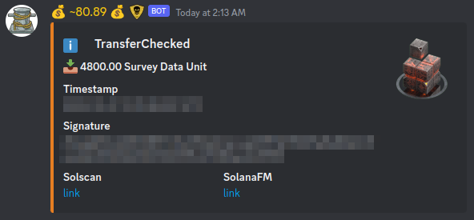

# Solana Wallet Discord Bot

A Simple Solana-Wallet/Accounts-Tracker

## Commands

- `$help` Shows this message
- `$config` Prints config store infos
- `$address` Prints wallet-address helper
- `$accounts` Prints account balances

# How to run this bot:

1. Install and setup docker + docker-compose!
2. Copy the `config.json.sample` to `config.json`
3. Edit the `config.json` to a watch a single wallet.
4. Start the bot using `docker-compose up -d`

## Views

# Discord-Bot/Token

When you create the discord token on `https://discord.com/developers/applications`
make sure to enable `MESSAGE CONTENT INTENT`' under:

``BOT -> Build-A-Bot -> Privileged Gateway Intents -> MESSAGE CONTENT INTENT = ENABLE``
